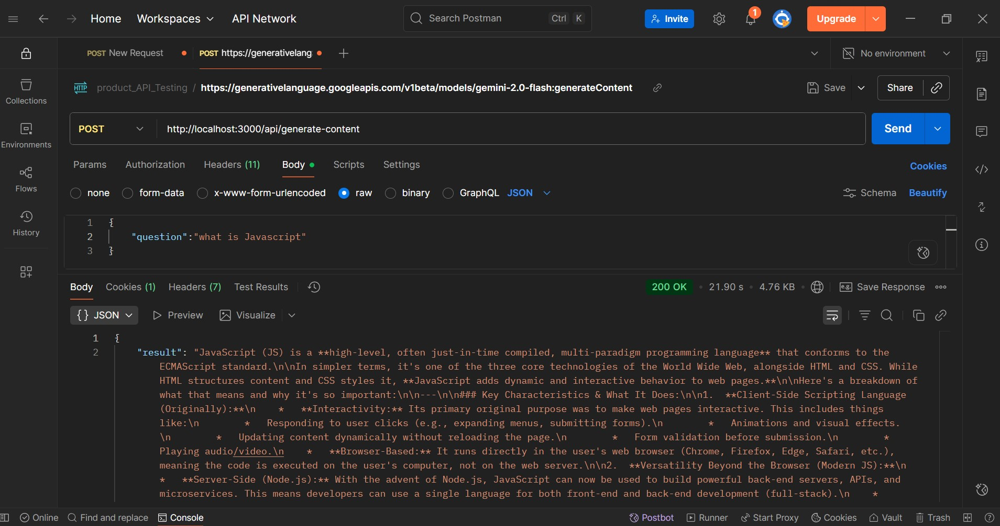

# Gemini Node.js API

This project is a small learning experiment that shows how to use **Google Gemini AI API** with **Node.js**.
It demonstrates how to send a prompt to Gemini and get AI-generated responses through both **Postman** (API testing) and **CLI (Command Line Interface)**.

---

## 🖼️ Project Preview

Here’s a quick look at the project in action:



> *(Replace `preview.png` with your actual image name if different)*

---

## 📘 Overview

This project helps to understand how to:

* Connect Node.js with the **Google Gemini API**
* Build a simple **Express.js API endpoint**
* Send prompts and get AI responses in JSON
* Test the API using **Postman** and the command line

---

## ⚙️ Tech Stack

* **Node.js**
* **Express.js**
* **dotenv**
* **@google/genai**

---

## 📂 Project Structure

```
├── controller/
│   └── ai.controller.js
├── utils/
│   └── gemini.js
├── server.js
├── .env
├── img.jpg
└── package.json
```

---


## 🧠 Example API Usage (via Postman)

**POST** `http://localhost:5000/api/ask`
**Body (JSON):**

```json
{
  "question": "What is JavaScript?"
}
```

**Response:**

```json
{
  "result": "JavaScript is a programming language used to build web applications..."
}
```

## 🎯 Purpose

This project is for **learning and experimentation** — a simple way to understand how to integrate and test **Gemini API** in Node.js applications.

